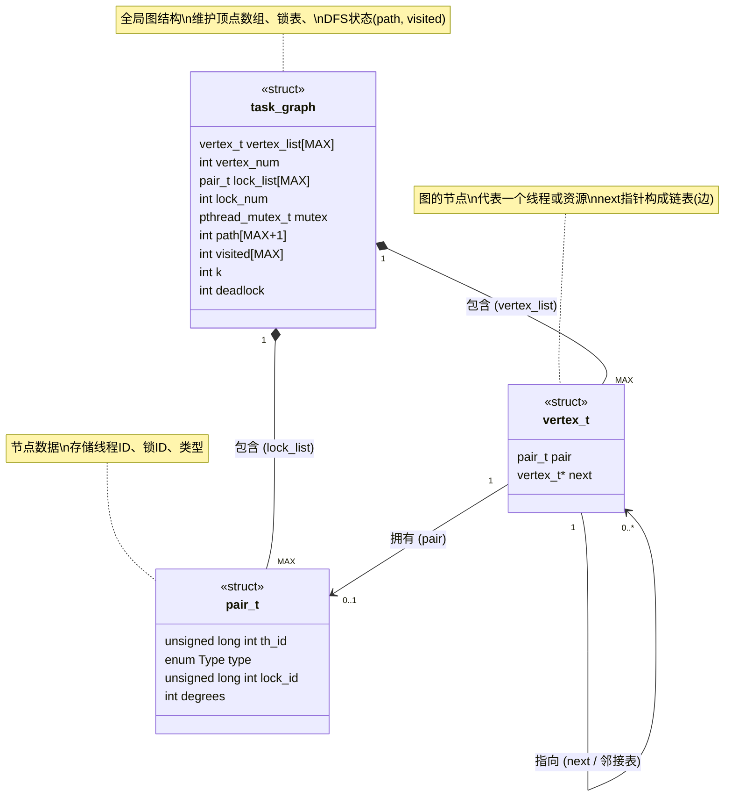
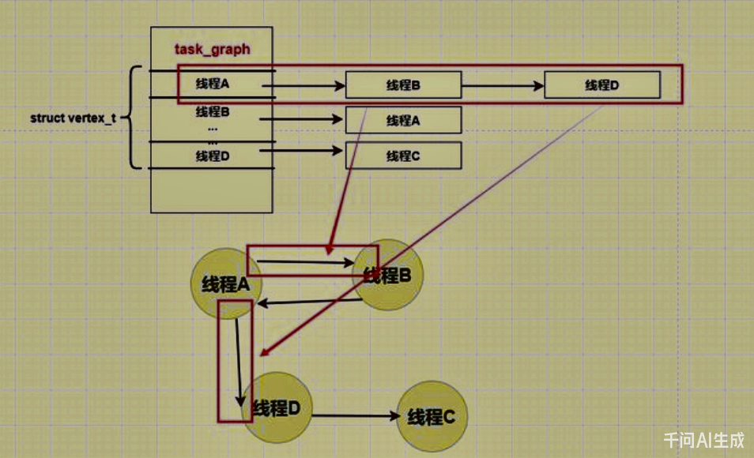

# DL_Detector 死锁探查器


通过如图所示的有向图数据结构进行检测:


通过dfs算法进行变量如果遍历某一个邻接列表时，发现已经遍历过该邻接列表，则说明出现了死锁。

通过不断遍历每一个邻接列表来检测死锁。



启动检测线程，每秒检测一次是否发生死锁

运行结果:

```bash
./output/main
start_check
-----------detect deadlock----------
No deadlock
----------------------------------
thread_routine 1 : 132766547043904
thread_routine 2 : 132766538651200
thread_routine 3 : 132766530258496
thread_routine 4 : 132766521865792
-----------detect deadlock----------
No deadlock
----------------------------------
-----------detect deadlock----------
Deadlock Path:
509597248 --> 501204544 --> 492811840 --> 517989952 --> 509597248
----------------------------------
-----------detect deadlock----------
Deadlock Path:
509597248 --> 501204544 --> 492811840 --> 517989952 --> 509597248

```